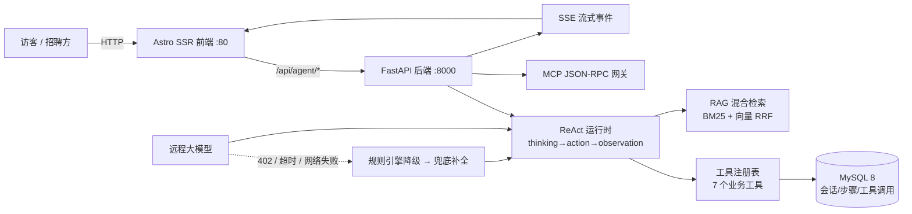

<div align="center">

# 于翔堃 · AI Agent 应用开发工程师

**2026 届计算机本科 · 现居天津（静海）· 随时到岗**


> 我能把一段**模糊的业务需求**拆成有序步骤，用 AI Agent + 工具编排把它跑通、上线，并让它**挂得住**（降级、容错、可追溯）。
> 下面每一个能力，都配了**现在就能点开的链接**或**代码位置**——不用等我解释，您先验证。

**🔴 30 秒验证入口（推荐先看这个）**

| 入口 | 地址 | 能看到什么 |
| :--- | :--- | :--- |
| 在线作品集 | **http://101.42.45.157/** | 我一个人做完并部署上线的整站（Astro SSR + AI 后端 + MySQL） |
| AI 实时对话 | **http://101.42.45.157/chat** | 自研 ReAct 运行时：思考 → 调工具 → 观察 → 回答，SSE 流式逐字输出 |
| 游戏世界 | **http://101.42.45.157/game** | 7 款零引擎原生 Canvas 游戏（约 1.1 万行） |
| 简历 PDF | [public/resume.pdf](public/resume.pdf) | 一页纸简历 |

</div>

---

## 目录

- [一、给招聘方：30 秒速览](#一给招聘方30-秒速览)
- [二、岗位匹配对照表](#二岗位匹配对照表)
- [三、核心项目证据](#三核心项目证据)
- [四、技术能力矩阵](#四技术能力矩阵)
- [五、系统架构](#五系统架构)
- [六、代码地图](#六代码地图)
- [七、本地运行](#七本地运行)
- [八、如实说明（您一定会问的三个问题）](#八如实说明您一定会问的三个问题)
- [九、联系方式](#九联系方式)
- [十、其他可核验仓库](#十其他可核验仓库)

---

## 一、给招聘方：30 秒速览

| 项目 | 内容 |
| :--- | :--- |
| **我在找** | AI 应用开发 / AI Agent（智能体）开发 / 企业数字化落地方向的初级岗位；同方向的**实施交付、低代码、企业信息化**岗位同样在考虑 |
| **我能立刻上手** | Python + FastAPI 全异步服务；ReAct 多步推理 Agent；RAG 混合检索；MCP 工具网关；SSE 流式；MySQL 建模；Astro/React/Vue3 前端；Docker + 云主机部署 |
| **另一条腿** | Java 17 / Spring Boot 3.5 / MyBatis / JPA；毕设交付过 8 模块 12 表 88 端点的业务系统 + 366 个测试用例 |
| **最大差异化** | 大多数应届生交不出一个**能打开的链接**。我能：整站线上运行、AI 助手可实时对话、代码全部开源可查 |
| **到岗** | 已毕业（2026 年 7 月），现居天津静海，随时到岗，无家庭牵绊 |

---

## 二、岗位匹配对照表

> 按 JD 里最常见的写法对照。右侧"在哪验证"可直接在浏览器或代码中核对，不靠我自述。

### A. AI 应用 / Agent 开发方向

| JD 常见要求 | 我的对应实现 | 在哪验证 |
| :--- | :--- | :--- |
| 大模型应用 / Agent 开发经验 | 自研 **ReAct 多步推理运行时**：思考 → 调用工具 → 观察结果 → 再思考，含单步超时、最大步数、轨迹落盘 | `server/app/agent/runtime.py`（182 行） |
| RAG / 企业知识库 | **手写 BM25 + 特征哈希向量 + RRF 融合**检索（非调库），中英混合切词、Top-K 融合重排 | `server/app/rag/retriever.py`（136 行） |
| Function Calling / 工具调用 | 自研工具注册表，7 个业务工具（技能查询、项目检索、JD 匹配、JD 分析、计算、时间、统计），调用全量持久化 | `server/app/agent/tools.py`（342 行） |
| MCP / 工具生态 | 自研 **MCP JSON-RPC 网关**（协议版本 `2025-06-18`），支持 `initialize` / `tools/list` / `tools/call` 与错误码规范 | `server/app/mcp_server.py`（68 行） |
| 流式输出 / 用户体验 | **SSE 事件流**：`thinking` → `action` → `observation` → `answer` → `done`，前端逐字渲染 | `server/app/api/chat.py`；前端 `/chat` 页 |
| 服务稳定性 / 降级 | **三级降级容错**：远程模型失败（402/超时/网络）→ 自动切规则引擎 → 兜底补全，用户永远不看到空白页 | `runtime.py` + `provider.py`（规则引擎 616 行） |
| 可观测性 | 每一步的思考、工具、输入、观察、耗时全部落库，可回放；另有 trace / eval 接口 | `server/app/api/trace.py`、`eval.py` |

### B. 实施交付 / 低代码 / 企业信息化方向

> 这一段是**能力迁移**，不是转行包装：我做 Agent 编排时干的事，和做流程配置是同一件事。

| JD 常见要求 | 我做过的对应工作 | 在哪验证 |
| :--- | :--- | :--- |
| 需求调研 → 结构化产物 | Agent 工具契约就是"需求结构化"：每个工具定义清晰的输入/输出/失败处理 | `tools.py` 中的 `参数模式` 定义 |
| 流程配置 / 审批流设计 | ReAct 循环本质是**状态机 + 条件分支编排**（与宜搭/简道云审批流、OA 流转同一心智模型） | `runtime.py` 的 `for 步 in range(...)` 主循环 |
| 系统集成 / API 对接 / 联调 | 手写 JSON-RPC 网关：读协议 → 定义契约 → 对接 → 处理超时与异常 | `server/app/mcp_server.py` |
| 上线方案 / 回滚 / 应急预案 | 三级降级设计 = "主链路挂了怎么办"的预案思维（迁移到上线即回滚点与数据校验） | `runtime.py` 的 `_降级` / `_降级推送` |
| 权限、流程、报表、系统配置、操作日志留痕 | 毕设《网上村委会业务办理系统》8 模块 12 表，含 RBAC 权限、流程流转、POI 报表导出（证件号脱敏）、操作留痕 | 外部仓库 [mo-faa/YXK](https://github.com/mo-faa/YXK) |
| 客户现场 / 文档交付 | 全站部署文档、启动脚本、环境自检报错（缺密钥/数据库连不上直接给中文指引） | `server/app/main.py` 的 `环境自检()` |

### C. 测试 / 技术支持 / 运维方向

| JD 常见要求 | 我的对应证据 | 在哪验证 |
| :--- | :--- | :--- |
| 测试用例 / 自动化 | 毕设 **362 个 JUnit 5 + Mockito 用例**（实测统计）；Java 匹配服务 3 个测试类（控制器 MockMvc、限流、规则引擎） | `server-java/src/test/java/dev/yuxiangkun/matcher/` |
| 服务部署 / 运维 | 腾讯云 Windows Server 2022 部署：Astro SSR 占 :80、uvicorn 占 :8000、MySQL 8，计划任务守护自愈 | 站点 24h 在线；`启动总控.py` |
| 故障排查 | 后端启动即自检（密钥、模型地址、数据库连通性），失败直接给出可执行的中文修复提示 | `main.py` |
| 缓存 / 限流 / 降级 | JD 内容哈希缓存 + 每 IP 固定窗口限流（429）；Redis 不可用时自动降级 Caffeine，接口语义一致 | `server-java/.../service/` |

---

## 三、核心项目证据

### ① 智能体工坊 + 本简历站（本仓库主体）

一个能真实对话的 AI Agent 系统，以及承载它的作品集站点。前后端、检索、工具网关、部署全部由我一人完成。

- **后端**：FastAPI + SQLAlchemy 2.0 异步 + MySQL 8，约 2,000 行 Python
- **前端**：Astro 7（SSR）+ React 18 + TypeScript + UnoCSS，约 27,000 行
- **关键设计**：`三级降级容错` · `SSE 流式` · `MCP 工具网关` · `RAG 混合检索` · `ReAct 轨迹持久化`
- **线上**：http://101.42.45.157/ （首页 /chat /game 均已验证 200）

### ② NEON CYBER 游戏平台（7 款原生 Canvas 游戏，约 1.1 万行）

零游戏引擎，纯 Canvas 2D 手写。

- **在线试玩**：http://101.42.45.157/game
- **代码位置**：本仓库 [`src/lib/game/`](src/lib/game/)（`main.js` / `games/` / `core/`，可直接点开核验）——该平台**未单独建库**，代码随本仓库一并发布

| 游戏 | 关键技术点 |
| :--- | :--- |
| 维度迷宫 DimensionMaze | 递归回溯生成 + BFS 追逐 AI |
| 反应力 ReactionGame | 16ms 节流 / 200ms 防抖、输入延迟测量 |
| 闪电射手 LightningShooter | 对象池、离屏预渲染、DPR 自适应 |
| 霓虹防线 NeonDefense | 塔防路径与经济系统 |
| 机械对战 MechBattle | 回合制状态机 |
| NeonArena / StarOcean | 竞技场与弹幕射击变体 |

工程侧共性：`GameBase` 生命周期抽象、`GameManager` 路由与状态管理、`ProfileManager` 存档、i18n、统一粒子与音效模块。

### ③ AI 简历匹配平台（Java 侧，约 1,000 行）

粘贴一段 JD，输出与该岗位的技能匹配度：命中技能、缺失技能、总分与改进建议。

- Java 17 + Spring Boot 3.5 + Data JPA + MySQL/H2
- Redis 缓存 + 固定窗口限流，**Redis 不可用时自动降级 Caffeine 内存缓存**（接口语义一致）
- LLM 输出结构化 JSON + 容错解析；无 Key 时自动走本地规则引擎，响应体 `engine` 字段标识降级来源
- Dockerfile 多阶段构建（Maven → JRE）+ docker-compose 编排 app/MySQL/Redis
- 详见 [`server-java/README.md`](server-java/README.md)

---

## 四、技术能力矩阵

| 领域 | 掌握内容 |
| :--- | :--- |
| **AI Agent / LLM 工程** | 多步推理 Agent 运行时、RAG（BM25 + 向量 RRF 融合）、MCP 协议网关、Function Calling、SSE 流式、三级降级容错、Prompt 工程、轨迹可观测 |
| **语言** | Python、TypeScript、Java、JavaScript、SQL |
| **前端** | Astro（SSR / 视图过渡）、React 18、Vue 3 + Pinia、Vite、UnoCSS、Canvas 2D、WCAG 2.1 无障碍适配 |
| **后端** | FastAPI（全异步）、Spring Boot 3.5、MyBatis、Data JPA、REST API、JWT 鉴权 |
| **数据** | MySQL 8（建模与异步 ORM）、SQLAlchemy 2.0、Redis（缓存/限流，含降级）、SQLite、H2 |
| **部署运维** | 腾讯云 Windows Server 2022、Docker（多阶段构建 + compose）、Nginx、进程守护与自愈、Git |
| **测试** | pytest、JUnit 5 + Mockito + MockMvc、Playwright 浏览器级端到端验证 |
| **AI 工具链** | Claude Code、Codex、TRAE、WorkBuddy；可复用技能库；MCP 服务端集成；提交前钩子（凭据 / 硬编码 / SQL 注入扫描） |

> 说明：以上均为**个人自研 / 课程项目**，非企业生产环境；未使用 Dify / Coze / LangChain，相关能力为自研实现，可快速迁移至主流框架。

---

## 五、系统架构



---

## 六、代码地图

```
.
├── src/                      # 前端（Astro + React + TS，约 27k 行）
│   ├── pages/                # index · chat（AI 助手）· game（游戏入口）· agent
│   ├── components/           # Bento 卡片体系、主题切换、联系人、技术栈矩阵
│   ├── lib/game/             # 7 款原生 Canvas 游戏 + 引擎抽象（约 11k 行）
│   ├── lib/                  # SSE 客户端、剪贴板/复制提示、无障碍、动效
│   └── site-config.ts        # 站点与个人信息的唯一信息源
├── server/                   # AI 后端（FastAPI，约 2k 行 Python）
│   └── app/
│       ├── agent/runtime.py  # ReAct 多步推理运行时（含三级降级）
│       ├── agent/provider.py # 模型提供者 + 规则引擎降级
│       ├── agent/tools.py    # 工具注册表 + 技能图谱 + 岗位知识库
│       ├── rag/retriever.py  # BM25 + 特征哈希向量 + RRF 融合
│       ├── mcp_server.py     # MCP JSON-RPC 工具网关（2025-06-18）
│       ├── api/              # chat（SSE）· trace（轨迹）· eval（评测）
│       └── models.py         # MySQL 六表建模
├── server-java/              # AI 简历匹配平台（Spring Boot 3.5 + Redis/Caffeine）
├── public/resume.pdf         # 简历 PDF
└── 启动总控.py                # 一键启动：MySQL → 后端 → 前端（含自检与守护）
```

---

## 七、本地运行

### 前端（Astro）

```bash
pnpm install
pnpm dev          # http://localhost:4321
```

### 后端（FastAPI + MySQL）

```bash
cd server
python -m venv .venv && .venv/Scripts/activate
pip install -r requirements.txt
# 在 server/.env 配置：模型接口地址 / 模型密钥 / 模型名称 / 数据库连接串
python -m uvicorn app.main:app --port 8000
```

启动即自检：缺模型密钥或数据库连不上时**直接中止并给出中文修复提示**，不会带着残缺配置跑起来。

### 一键启动（Windows）

双击 `启动.bat`：MySQL → uvicorn(:8000) → Astro(:4321)，含自检与全停守护。

### Java 侧

```bash
cd server-java && mvn spring-boot:run    # 默认 H2 + Caffeine，零依赖
```

---

## 八、如实说明（您一定会问的三个问题）

**1. 有没有企业实习经历？**
没有。上述项目全部是个人自研与课程/毕设项目，**不是企业生产环境代码**。
我能提供的是另一种证据：**它们都在线上跑着，且代码全部开源**。您可以现在打开 http://101.42.45.157/chat 试一次，再回头看 `runtime.py` 是不是真的按 ReAct 循环在工作。

**2. 用没用 Dify / Coze / LangChain / n8n？**
没用。ReAct 运行时、RAG 融合检索、MCP 网关都是**手写实现**（见代码地图）。
代价是没踩过这些框架的坑，收益是我清楚每一层在做什么、出问题该改哪里。若岗位要求这些框架，我有自研实现的底子，迁移成本低于从零学起。

**3. 代码是不是 AI 写的？**
AI 编程工具（Claude Code / Codex / TRAE / WorkBuddy）是我的日常工具链，这一点我不回避。
我的分工是：**定义架构、拆分模块、确定接口契约、编写测试用例与验收标准，做 code review 与集成验证**；AI 在既定框架内生成实现。这也是我能在几个月内独立交付多个完整系统的原因。
如果贵司看重"会用 AI 提升交付效率"，这是我的加分项；如果需要现场手写代码验证能力，我也随时接受。

---

## 九、联系方式

| 渠道 | 内容 |
| :--- | :--- |
| 邮箱 | **3062949899@qq.com**（工作日 2 小时内回复） |
| QQ | 3062949899 |
| 在线作品集 | http://101.42.45.157/ |
| GitHub | https://github.com/mo-faa/jianli |

> 面试时我可以**直接演示**：打开 `/chat` 提一个问题，您可以看到它的思考过程、调用了哪个工具、返回了什么——这是我能拿出的最直接的证据。

---

## 十、其他可核验仓库

| 项目 | 说明 | 仓库 |
| :--- | :--- | :--- |
| 《网上村委会业务办理系统》 | 毕业设计：Spring MVC 7.0.2（非 Boot）+ MyBatis，8 模块 12 表 80 处请求映射，**362 个 JUnit 5 + Mockito 用例**；BCrypt 加密、HMAC-SHA256 CSRF 令牌、POI 流式导出并对证件号脱敏 | [mo-faa/YXK](https://github.com/mo-faa/YXK) |

---

## License

站点基于 [astro-bento-portfolio](https://github.com/Ladvace/astro-bento-portfolio)（MIT）二次开发，视觉框架版权归原作者；本仓库中的业务逻辑、AI 后端、游戏平台与内容均为本人实现，同样以 [MIT](LICENSE) 发布。
